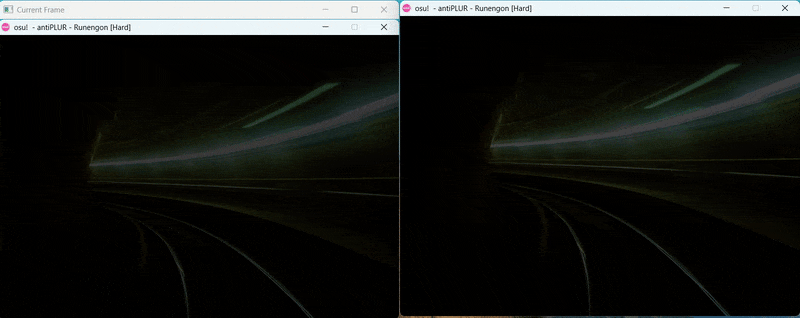

# Introduction
## 12/02
### 影像擷取 + 二元化處理
- ddd
- ddd
### 範例2：特定顏色物件追蹤
顏色轉換 ==> HSV
- 顏色塞選
- 區域輪廓
- 區域輪廓篩選
## 12/08
### numpy : https://blog.techbridge.cc/2020/08/24/numpy-zen-intro-tutorial/
應用相鄰影像差異化偵測移動
## 12/15
### 抓出變動區塊的範圍，劃出方框
## 12/22
### 使用 numpy 進行計算改進
- 範例:
bbb
bbb
### 修改後的程式
## 12/29
### 分析 verticle_projection 來偵測遊戲開始的訊號（進行中）

## 1/21
### 程式碼:

### 分析起始畫面

#### 判斷中間區域有極大變動值的累積
#### 判斷黃色箭頭（遊戲起始階段）
####顏色遮罩

###將資訊輸出檔案
## 1/25
### 檢測間隔大小,找出大位置

